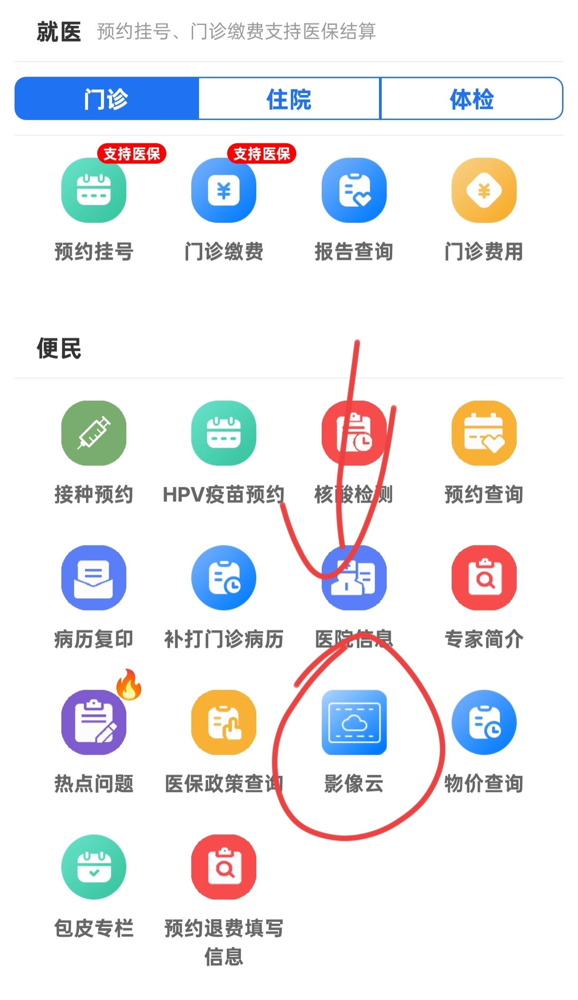
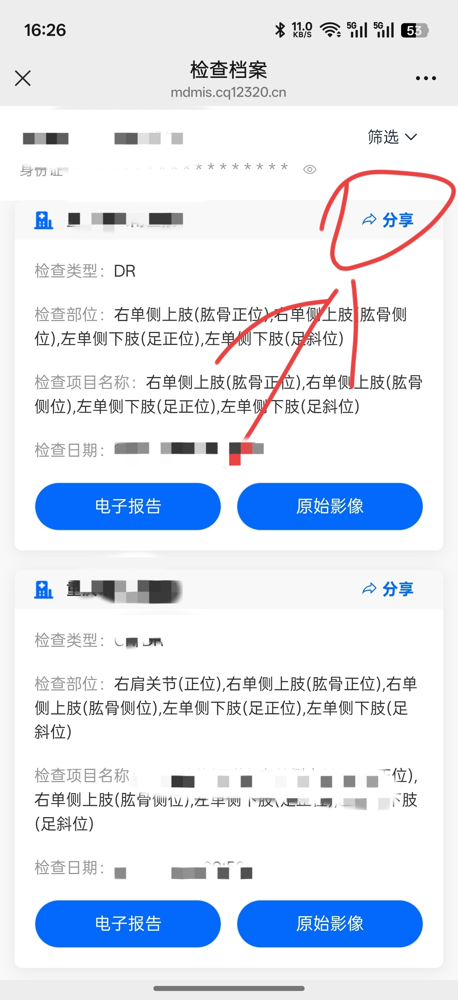
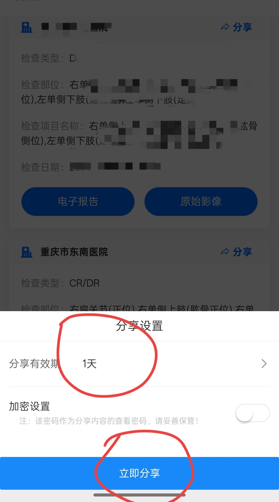
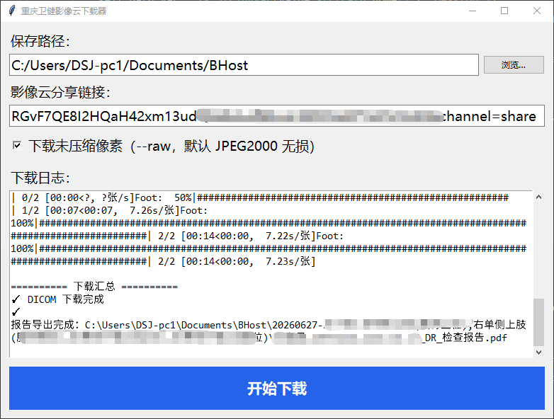

# cloud-dicom-downloader

医疗云影像下载器，从在线报告下载 CT、MRI、DR 等片子的 DICOM 文件，并可同时导出电子报告 PDF 与 JPG 预览图。

本项目基于开源项目 [Kaciras/cloud-dicom-downloader](https://github.com/Kaciras/cloud-dicom-downloader) 二次开发，主要针对\*\*重庆卫健委医学影像云在线报告站点（mdmis.cq12320.cn）\*\*做了适配与功能增强，并提供图形界面（GUI）。

> \[!WARNING]
> 本项目仅供个人学习与备份本人医疗影像使用，请勿用于商业用途或批量爬取。使用本项目所产生的一切后果由使用者自行承担。

## 与上游的主要差异

| 项目             | 上游                 | 本 Fork                                          |
| -------------- | ------------------ | ----------------------------------------------- |
| 入口             | 命令行`downloader.py` | **图形界面** **`gui.py`（唯一入口）**                     |
| DICOM 转 JPG    | 无                  | **每个** **`.dcm`** **同时生成同名** **`.jpg`**（应用窗宽窗位） |
| 电子报告 PDF       | 无                  | **用 Edge 无头浏览器导出报告页为 PDF**                      |
| CT 等大影像        | 首次请求可能失败           | **自动轮询等待**（最多约 3 分钟）                            |
| 保存路径           | 固定`download/`      | **GUI 可选，默认桌面**                                 |
| 文件夹命名          | `患者-检查-时间`         | `时间-患者-检查`（时间在前便于排序）                            |
| PDF 与 DICOM 耦合 | —                  | **两个任务独立容错**，一个失败不影响另一个                         |
| 入口启用的站点        | 9 个                | **仅 mdmis.cq12320.cn**（其他站点爬虫代码保留未启用）           |

## 输出结构

一次下载会得到如下结构（以桌面为例）：

```text
Desktop/
└── 20260627-张＊三-右单侧上肢(肱骨正位),.../
    ├── Humerus/
    │   ├── 0.dcm
    │   ├── 0.jpg      ← JPG 预览
    │   ├── 1.dcm
    │   └── 1.jpg
    ├── Foot/
    │   └── ...
    └── 张三三_66690333_2026-06-27_DR_检查报告.pdf   ← 电子报告
```

- DICOM 切面用 `.dcm`，可用阅片软件或在线阅片网站查看。
- 同名 `.jpg` 便于快速预览，已应用窗宽窗位（WindowCenter/WindowWidth）做灰度映射。
- PDF 命名规则：`患者姓名_检查号_报告日期_检查类型_检查报告.pdf`。

## 环境要求

- **Python 3.10+**（依赖 pydicom 3.x，已在 Windows + Python 3.13 环境下验证）
- **Windows**（GUI 使用标准库 tkinter，随官网 Python 安装包自带；PDF 导出依赖系统的 Edge 浏览器）
- 网络可访问目标报告链接

## 安装

```bash
# 1. 克隆代码
git clone https://github.com/smartzzx/chongqing-cloud-dicom-downloader.git
cd chongqing-cloud-dicom-downloader

# 2.（建议）创建并激活虚拟环境
python -m venv .venv
.venv\Scripts\activate

# 3. 安装依赖（DICOM 下载 + JPG 转换 + PDF 报告导出）
pip install -r requirements.txt
```

依赖说明见 [requirements.txt](requirements.txt)；如需运行测试，改装 `pip install -r requirements-dev.txt`（见文末[开发与测试](#开发与测试)）。

> PDF 导出优先调用系统已安装的 Edge，无需额外下载浏览器；若 Edge 启动失败，可运行 `playwright install chromium` 改用 Playwright 捆绑的浏览器。

## 使用方法

### 1. 获取分享链接

在各大医院的小程序里找到「影像云」入口，点击「分享影像」，选择需要下载的那一份：





有效期建议设为 1 天（够用即可，时间太短可能不够用）：



拿到链接后，先在**电脑浏览器**里粘贴打开，确认能正常显示图像，再使用本项目去下载，不然有些影像数据较大，服务器首次加载很慢，直接下载偶尔会加载不出来。

### 2. 运行程序

```bash
python gui.py
```

界面说明：

1. **保存路径**：默认桌面路径，可点「浏览…」更改。
2. **分享链接**：粘贴上一步拿到的分享链接（含 `#` 也无妨）。
3. **下载未压缩像素**：勾选后下载未压缩像素（默认 JPEG2000 无损压缩）。
4. 点「开始下载」：DICOM 影像与 PDF 报告**并行下载**，日志区实时显示进度，互不影响。

运行成功后的界面：



## 支持的站点

当前入口仅启用：

### mdmis.cq12320.cn（重庆卫健委影像云）

URL 格式：`https://mdmis.cq12320.cn/wcs1/mdmis-app/h5/#/share/detail?share_id=<hex>&content=<token>&channel=share`

特点：

- 无需密码。
- 影像查看器为海纳医信。
- CT 等大影像首次请求会返回等待页，程序自动轮询重试。
- 同时下载 DICOM、JPG 预览、电子报告 PDF。

## 下载须知

- 报告链接必须有效，能在浏览器打开，未过期。
- 部分检查的影像数据较大（如 CT），服务器后台需要时间准备，程序会等待重试。
- 少数系统不提供原始文件，无法下载（已知：锐珂 CareaStream、联众医疗 eImage、东软睿影 cloud film system）。
- 由于未能下载到标签的类型信息，DICOM 中所有私有标签保存为 `LO` 类型（会产生 pydicom 的 LO 超长警告，已在本项目 GUI 中抑制，不影响文件读写）。

## 项目结构

```text
.
├── gui.py                  # 图形界面入口（DICOM + PDF 并行，唯一入口）
├── requirements.txt        # 运行时依赖
├── requirements-dev.txt    # 开发与测试依赖（含运行时依赖）
├── pytest.ini              # pytest 配置（asyncio 自动模式）
├── README.md
├── LICENSE
├── .gitignore
├── picture/                # README 中使用的截图
├── crawlers/
│   ├── _utils.py           # 通用工具（HTTP 客户端、路径命名、保存目录）
│   ├── cq12320.py          # 重庆卫健委爬虫（含 CT 轮询等待）
│   └── hinacom.py          # 海纳医信爬虫（DICOM 写入 + JPG 转换）
└── test/
    ├── fixtures/           # 抓包样本（HTTP / WebSocket 转储）
    └── test_utils.py       # 工具函数与 HTTP 异常转储测试
```

## 开发与测试

```bash
# 安装含测试框架在内的全部依赖
pip install -r requirements-dev.txt

# 在项目根目录运行测试（pytest.ini 已配置 asyncio_mode = auto，异步用例无需额外标记）
pytest
```

## 致谢

- 原项目：[Kaciras/cloud-dicom-downloader](https://github.com/Kaciras/cloud-dicom-downloader)
- 爬虫流程参考其作者博客：<https://blog.kaciras.com/article/45/download-dicom-files-from-hinacom-cloud-viewer>

## 许可证

继承上游许可证（请参照上游仓库声明）。
